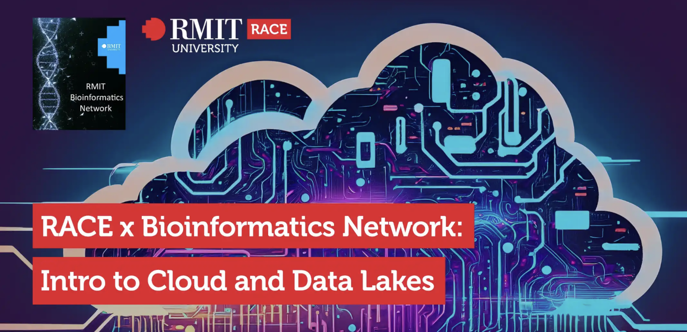

{width="100%"}

# Description

RACE and the Bioinformatics Network are hosting a training event on "Intro to Cloud and Data Lakes."

This event will introduce AWS Cloud and RACE, along with a hands-on data lakes workshop. Supported by Biomedical and Health Innovation Platform and Information in Society Platform EIPs (Enabling Impact Platforms - Research).

The training is open to all RMIT staff and students with no prior coding experience required.

Overview:

1.  Navigating the RACE Hub for Seamless Cloud Access: Discover the RMIT Advanced Cloud Ecosystem (RACE)

2.  Cloud Fundamentals & Data Lake Essentials: Get a clear understanding of what AWS Cloud is why it's revolutionising research, and the crucial role of data lakes in managing massive datasets.

3.  Get Hands On: Learn where to find and how to navigate a vast array of free, publicly available datasets that can enrich and accelerate individual research projects.

Open to all RMIT staff and students, we look forward to seeing you there! This is a Quarto website.
